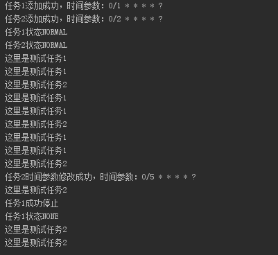

# 定时任务工具整理   


本工具在quartz包的基础上，封装了新增、修改、删除和获取定时任务状态的功能，方便对多个定时任务的管理。

#### 详情见工具类：[QuartzManager](java/com/yangchd/util/QuartzManager.java)

#### jar包资源：[quartz-2.2.1.jar](resources/quartz-2.2.1.jar)

#### 方法如下：
```java

    /**
     * 添加一个定时任务，使用默认的任务组名，触发器名，触发器组名
     *
     * @param job     定时任务实现job
     * @param jobName 任务名称
     * @param time    任务时间策略
     */
    public void addJob(String jobName, Class<? extends Job> job, String time) throws SchedulerException, ParseException

    /**
     * 添加一个定时任务
     *
     * @param jobName          任务名
     * @param jobGroupName     任务组名
     * @param triggerName      触发器名
     * @param triggerGroupName 触发器组名
     * @param job              任务
     * @param time             时间设置，参考quartz说明文档
     */
    public void addJob(String jobName, String jobGroupName, String triggerName, String triggerGroupName, Class<? extends Job> job, String time) throws SchedulerException, ParseException

    /**
     * 修改一个任务的触发时间(使用默认的任务组名，触发器名，触发器组名)
     *
     * @param jobName 任务名
     * @param time    时间参数
     */
    public void modifyJobTime(String jobName, String time) throws SchedulerException, ParseException
    
    /**
     * 修改一个任务的触发时间
     *
     * @param triggerName      触发器名称
     * @param triggerGroupName 触发器组
     * @param time             时间参数
     */
    public void modifyJobTime(String triggerName, String triggerGroupName, String time) throws SchedulerException, ParseException
    
    /**
     * 移除一个任务(使用默认的任务组名，触发器名，触发器组名)
     *
     * @param jobName 任务名称
     */
    public void removeJob(String jobName) throws SchedulerException
    
    /**
     * 移除一个任务
     *
     * @param jobName          任务名称
     * @param jobGroupName     任务组
     * @param triggerName      触发器名称
     * @param triggerGroupName 触发器组
     */
    public void removeJob(String jobName, String jobGroupName, String triggerName, String triggerGroupName) throws SchedulerException
    
    /**
     * 获取定时任务运行状态
     *
     * @param jobName 任务名称
     */
    public Trigger.TriggerState getJobState(String jobName) throws SchedulerException
    
    public Trigger.TriggerState getJobState(String jobName, String triggerGroupName) throws SchedulerException

```

#### 运行demo：

demo详情见：[Demo.java](java/com/yangchd/demo/Demo.java)

运行结果：  




